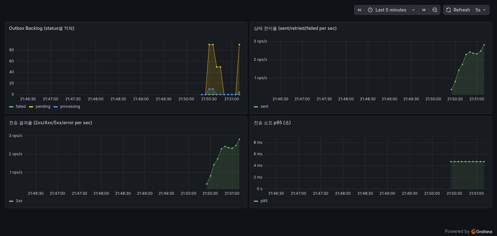
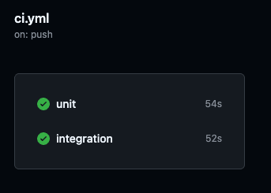

# Reliable Webhook Dispatcher

도메인 이벤트를 외부로 **잃지 않고, 추적 가능하게, 재처리 가능하게** 전달하는 Go 웹훅 디스패처.

주문 생성 같은 도메인 이벤트와 "보낼 이벤트"를 하나의 DB 트랜잭션에 묶고(outbox), 백그라운드 워커가 이벤트를 claim해 webhook으로 전송한다. 외부가 죽어도 이벤트는 보존되고, 실패는 기록·재시도되며, 끝내 안 되면 dead-letter로 남아 재처리된다.



## 무엇을 보장하나

| 목표 | 방법 | 검증 |
|---|---|---|
| **유실 0** | order와 outbox event를 같은 트랜잭션에 커밋 (dual-write 제거) | 정상 300 / 5xx 50 / 4xx 20건 부하 — 던진 주문 전부 수렴 |
| **중복 0 (내부 상태)** | `FOR UPDATE SKIP LOCKED` claim + `claim_token` fencing | 동시 N워커 claim 중복 0 (`go test -race`) |
| **중복 0 (외부 효과)** | `event_id`를 `Idempotency-Key`로 송신 + receiver dedup | mock distinct == 던진 수 |
| **추적 가능** | 모든 전송 시도 `delivery_attempts` 기록 + Prometheus + 구조화 로그 | `/metrics`, Grafana 대시보드 |
| **포기 0** | 재시도/backoff → `FAILED` dead-letter → 운영자 replay | 4xx 20건 FAILED → replay로 전부 복구 |

## 왜 만들었나

전 직장에서 외부로 알림과 이벤트를 발송하면서 세 가지에 막혔다. 외부가 죽으면 발송이 통째로 유실됐고, 발송 여부를 확인할 이력이 없어 로그를 뒤져야 했으며, 재시도는 막연히 붙어 있어 왜·몇 번 실패했는지 알 수 없었다. 전송이 개발자의 제어 밖에 있었다.

이 프로젝트는 그 문제를 정면으로 푼다 — 메시지 브로커 같은 인프라로 덮는 대신, 데이터의 흐름·외부 트랜잭션의 분리·outbox 워커·남는 기록이라는 본질을 직접 구현했다.

## 아키텍처

```text
POST /orders ──(한 트랜잭션)──> orders + outbox_events(PENDING)
                                       │
        worker pool ──claim (SKIP LOCKED + claim_token)──> PROCESSING
                                       │
                          webhook 전송 (트랜잭션 밖)
                       ┌───────────────┼───────────────┐
                      2xx          5xx / timeout       4xx
                       │               │                │
                      SENT       PENDING(재시도+backoff)  FAILED(dead-letter)
                                                          │
                                                  replay → PENDING
```

- 상태는 `PENDING → PROCESSING → SENT / PENDING / FAILED` 5개만 사용한다.
- 여러 워커가 동시에 같은 이벤트를 집지 않도록 `FOR UPDATE SKIP LOCKED`로 claim한다.
- claim 트랜잭션이 끝난 뒤(락 공백) 늦게 돌아온 워커의 상태 덮어쓰기는 `claim_token`으로 차단한다.
- 워커가 전송 도중 죽어 `PROCESSING`에 묶인 이벤트는 lease 초과 시 recovery가 `PENDING`으로 회수한다.

## 신뢰성 검증

부하·스트레스 테스트로 위 보장을 실측했다 (상세 · 재현 절차: [loadtest/RESULT.md](loadtest/RESULT.md)).

| 시나리오 | 결과 |
|---|---|
| 정상 300건 | sent +300, 중복 0, 생성 884 req/s (p95 125ms) |
| 5xx 장애 50건 | 전송 실패분이 `PENDING`으로 보존 → 복구 후 자동 수렴, 유실 0 |
| 4xx 장애 20건 | `FAILED` dead-letter → replay로 전부 복구 (멱등) |

> 처리량 수치는 측정 환경에 따라 다르니 단언하지 않는다. 단언하는 건 구조적 사실 — 던진 건 전부 수렴하고, 같은 건 두 번 가지 않고, 외부가 죽어도 잃지 않는다.



## API

| 메서드 · 경로 | 용도 |
|---|---|
| `POST /orders` | 주문 생성 + outbox 이벤트 (`Idempotency-Key` 지원) |
| `GET /outbox` · `GET /outbox/stats` | outbox 조회 / 상태별 집계 |
| `GET /delivery-attempts` | 전송 시도 이력 |
| `GET /admin/dead-letters` | FAILED(dead-letter) 목록 |
| `POST /admin/dead-letters/replay` | 전체 FAILED replay |
| `POST /admin/outbox/{event_id}/replay` | 단건 replay |
| `GET /metrics` | Prometheus 메트릭 |
| `GET /health` · `GET /ready` | 헬스 / 레디니스 |

## 실행

```bash
docker compose up --build -d   # postgres + migrate + app + prometheus + grafana
curl localhost:8080/health     # {"status":"ok"}
```

- app: http://localhost:8080
- Prometheus: http://localhost:9090
- Grafana: http://localhost:3000 (대시보드 자동 등록)

부하·장애 주입 데모 절차는 [loadtest/RESULT.md](loadtest/RESULT.md) 참고.

## 기술 스택

Go 1.25 · PostgreSQL 17 · `database/sql` + `pgx` · 표준 `net/http` · `log/slog` · Prometheus · Grafana · Docker Compose · GitHub Actions

## 테스트

```bash
go test -race ./...                                # 단위
INTEGRATION_DATABASE_URL=... go test -race ./...   # 통합 (동시성 중복 0)
k6 run loadtest/order.js                           # 부하
```

## 프로젝트 구조

```text
main.go              앱 조립 + 생명주기(graceful shutdown)
internal/config      환경 설정
internal/httpapi     HTTP 서버·핸들러·mock receiver·미들웨어
internal/store       orders·outbox·delivery·idempotency
internal/worker      dispatcher·recovery
internal/metrics     Prometheus 메트릭
migrations           PostgreSQL 스키마
deploy               prometheus·grafana provisioning
loadtest             k6 부하 스크립트 + 결과(RESULT.md)
.github/workflows    CI (unit + integration)
```
